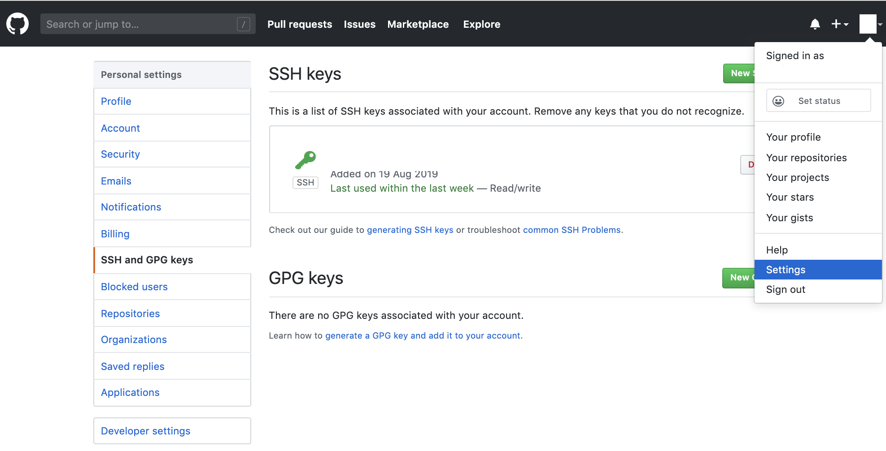

# Extending direnv

## TL;DR

Switching between development environments

### Switch to ```python``` environment with Python version 3.7.4 and no NodeJS installed

```bash
$ cd /tmp/env.python
Enabled   : HERE                             /tmp/env.python
Enabled   : node       -                     -
Enabled   : npm        -                     -
Enabled   : yarn       -                     -
Enabled   : python     3.7.4                 HERE/.env/python/bin/python
Enabled   : ssh        SSH_AGENT_PID: 71992  r14r@via-internet.de
```

### Switch to ```node``` environment with no Python and NodeJS 12.9.0

```bash
$ cd /tmp/env.node
Enabled   : HERE                             /tmp/env.node
Enabled   : node       12.9.0                HERE/.env/node/v12.9.0/bin/node
Enabled   : npm        6.11.1                HERE/.env/node/v12.9.0/bin/npm
Enabled   : yarn       -                     -
Missing   : python
Enabled   : ssh        SSH_AGENT_PID: 95612  r14r@via-internet.de
```

## Introduction

[direnv](https://direnv.net/) is a great tool for managing different development environment.

But, what i am missing, is the possiblility in setting up a environment very quick and with default components installed.

So, i decide to create this bash script to help me in create development environments.

## Install

Clone the repositoiry to your desired folder, e.g. $HOME/tools/direnv

```bash
$ cd $HOME
$ git clone https://github.com/r14r/cli_direnv.git tools/direnv
```

Add path of direnv_cli to PATH

```bash
$PATH=$HOME/tools/direnv/bin:$PATH
```

Check

```bash
$ which direnv_cli
$HOME/bin/direnv_cli
```

## Setup environment for Python

### Change to the destination folder of your nvironment

```bash
$ cd $HOME
$ mkdir -p /tmp/env.python
$ cd       /tmp/env.python/
```

### Initialize folder with direnv configuration files

```bash
$ direnv_cli --init master
    1: Create master.envrc
    2: Create master.config
    3: Create master.ssh-user
direnv: error .envrc is blocked. Run `direnv allow` to approve its content.
```

### Allow access to direnv

```bash
$ direnv allow
Enabled   : HERE                             /tmp/env.python
Enabled   : node       -                     -
Enabled   : npm        -                     -
Enabled   : yarn       -                     -
Missing   : python
Init      : SSH Agent                        /tmp/env.python/.ssh-environment
Enabled   : ssh        SSH_AGENT_PID: 71625  r14r@via-internet.de
```

### Install Python

```bash
$ direnv_cli --install python
Collecting pip
  Using cached https://files.pythonhosted.org/packages/8d/07/f7d7ced2f97ca3098c16565efbe6b15fafcba53e8d9bdb431e09140514b0/pip-19.2.2-py2.py3-none-any.whl
Installing collected packages: pip
  Found existing installation: pip 19.0.3
    Uninstalling pip-19.0.3:
      Successfully uninstalled pip-19.0.3
Successfully installed pip-19.2.2
```

### Reload direnv configuration

```bash
$ direnv reload
Enabled   : HERE                             /tmp/env.python
Enabled   : node       -                     -
Enabled   : npm        -                     -
Enabled   : yarn       -                     -
Enabled   : python     3.7.4                 HERE/.env/python/bin/python
Enabled   : ssh        SSH_AGENT_PID: 71625  r14r@via-internet.de
```

## Setup environment for NodeJS

### Change to the destination folder for ypur nvironment

```bash
$ cd $HOME
$ mkdir -p /tmp/env.node
$ cd       /tmp/env.node/
```

### Initialize folder with direnv configuration files

```bash
$ direnv_cli --init master
    1: Create master.envrc
    2: Create master.config
    3: Create master.ssh-user
direnv: error .envrc is blocked. Run `direnv allow` to approve its content.
```

### Allow access to direnv

```bash
$ direnv allow
Enabled   : HERE                             /tmp/env.node
Enabled   : node       -                     -
Enabled   : npm        -                     -
Enabled   : yarn       -                     -
Missing   : python
Init      : SSH Agent                        /tmp/env.node/.ssh-environment
Enabled   : ssh        SSH_AGENT_PID: 71625  r14r@via-internet.de
```

### Install LTS NodeJS

```bash
$ direnv_cli --install node --install-version lts
  1: Download NodeJS archiv for version v10.16.3
  2: Create /tmp/env.node/.env/node/v10.16.3
  3: Unpack NodeJS archiv
  4: Update NPM: /tmp/env.node/.env/node/v10.16.3/bin/npm
+ npm@6.11.1
added 19 packages from 13 contributors, removed 15 packages and updated 52 packages in 43.056s
```

### or install latest NodeJS

```bash
direnv_cli --install node --install-version latest
  1: Download NodeJS archiv for version v12.9.0
  2: Create /tmp/env.node/.env/node/v12.9.0
  3: Unpack NodeJS archiv
  4: Update NPM: /tmp/env.node/.env/node/v12.9.0/bin/npm
+ npm@6.11.1
updated 15 packages in 36.075s
```

### Reload direnv configuration

```bash
direnv reload
Enabled   : HERE                             /tmp/env.python
Enabled   : node       -                     -
Enabled   : npm        -                     -
Enabled   : yarn       -                     -
Enabled   : python     3.7.4                 HERE/.env/python/bin/python
Enabled   : ssh        SSH_AGENT_PID: 71625  r14r@via-internet.de
```

## Switching environments

```bash
$ cd /tmp/env.python
Enabled   : HERE                             /tmp/env.python
Enabled   : node       -                     -
Enabled   : npm        -                     -
Enabled   : yarn       -                     -
Enabled   : python     3.7.4                 HERE/.env/python/bin/python
Enabled   : ssh        SSH_AGENT_PID: 71992  r14r@via-internet.de
```

```bash
$ cd /tmp/env.node
Enabled   : HERE                             /tmp/env.node
Enabled   : node       12.9.0                HERE/.env/node/v12.9.0/bin/node
Enabled   : npm        6.11.1                HERE/.env/node/v12.9.0/bin/npm
Enabled   : yarn       -                     -
Missing   : python
Enabled   : ssh        SSH_AGENT_PID: 95612  r14r@via-internet.de
```

Notice the different SSH Agent PIDs. So, every environment has its own SSH Keys configured.

## SSH Configuration

I work with a lot of Github Repositories and for every repository, I created a ssh key and allow access via this ssh-key.




Within the direnv configuration, there is a file ```.envrc.ssh-user``` with the name of the github user. This name will be used in loading the ssh-agent with the corresponding keys.

So, the content of ```.envrc.ssh-user``` is

```bash
    demouser
```

and the key to load will be

```bash
$HOME/.ssh/id_rsa_demo-user
```

The result is a correct ssh-agent configuration

```bash
$ cat .envrc.ssh-user
demouser
$ direnv reload
Enabled   : HERE                             /tmp/env.node
Enabled   : node       12.9.0                HERE/.env/node/v12.9.0/bin/node
Enabled   : npm        6.11.1                HERE/.env/node/v12.9.0/bin/npm
Enabled   : yarn       -                     -
Missing   : python
Enabled   : ssh        SSH_AGENT_PID: 95612  demouser@via-internet.de
```

After this, you only have to cloen your repository with the right ssh link:

```bash
$ git clone git@github.com:<user>/<repository>.git
```
